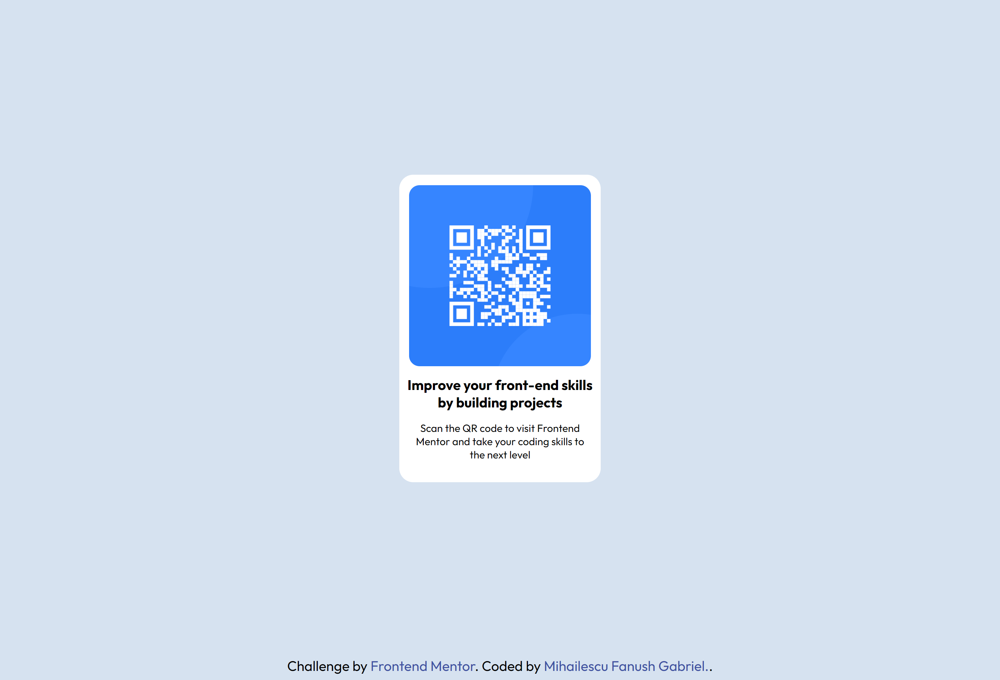

# Frontend Mentor - QR code component solution

This is a solution to the [QR code component challenge on Frontend Mentor](https://www.frontendmentor.io/challenges/qr-code-component-iux_sIO_H). Frontend Mentor challenges help you improve your coding skills by building realistic projects.

## Table of contents

- [Overview](#overview)
  - [Screenshot](#screenshot)
  - [Links](#links)
- [My process](#my-process)
  - [Built with](#built-with)
  - [What I learned](#what-i-learned)
  - [Continued development](#continued-development)
  - [Useful resources](#useful-resources)
- [Author](#author)
- [Acknowledgments](#acknowledgments)

**Note: Delete this note and update the table of contents based on what sections you keep.**

## Overview

### Screenshot

### Links

- Solution URL: [Add solution URL here](https://your-solution-url.com)
- Live Site URL: [Add live site URL here](https://your-live-site-url.com)

## My process

First things first, I mainly focused on understanding what was going on on the design folder of the project and also the challenge website, what were the details of the challenge, the steps, I tried to identify what positioning was used before actually adding it.
After that, I downloaded the folder, created my css folder where I started styling the pages side by side with the design folder opened so I can see what I'm aiming for.

### Built with

- Semantic HTML5 markup
- CSS custom properties
- Flexbox
- CSS Grid & Media Queries

### What I learned

This challenge was pretty easy to figure out, except that I had to figure some positioning using the naked eye for some things, such as "Is the text-description properly aligned with the title of the card and so on :D

I did however learned more about Media Queries and how to position elements using it as I noticed first-hand that there is a big emphasis on mobile responsiveness, so I had to modify the box to fit in a mobile resolution as well which was fun.

### Continued development

I plan on learning more about CSS properties that can be modified as I feel like I barely scratched the surface, I want to learn about the true power.

### Useful resources

- https://www.w3schools.com/css/css3_mediaqueries.asp - This helped me get some details about Media Query syntax. Easy to read & understand.
- https://codepen.io/pen/ - Amazing tool if you wanna try some settings before applying them on your project

## Author

- Website - Mihailescu Fanush Gabriel https://fanushhh.github.io/Stylized-Website/
- Frontend Mentor - @Fanushhh https://www.frontendmentor.io/profile/Fanushhh
